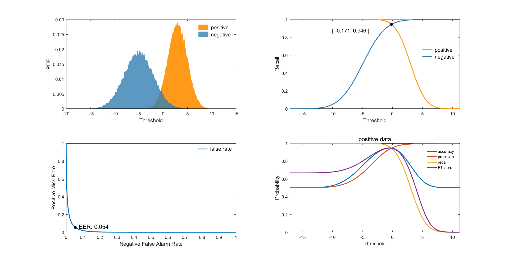

# Function
Evaluate the model's performance with some parameters like
+ Accuracy
+ Precision
+ Recall
+ F1score

and finally plot the figures of some useful parameters.

# Usage
```matlab
% -------------------------------------------------------
% [t,Accuracy,Precision,Recall,F1score] = evaluate(x1,x2,n)
% -------------------------------------------------------
% inputs:
%   x1 -- 1-D array with arbitrary length (positive data)
%   x2 -- 1-D array with arbitrary length (negative data)
%   n  -- Divide x1 and x2 into n pieces
% -------------------------------------------------------
% outputs:
%   t         -- X-axis of threshold
%   Accuracy  -- Accuracy  of positive data
%   Precision -- Precision of positive data
%   Recall    -- Recall  of positive data
%   F1score   -- F1score of positive data
% -------------------------------------------------------
```

# Example
```matlab
>> npieces = 100
>> positive_data = randn(5e4,1)*2+3.0;
>> negative_data = randn(6e4,1)*3-5.0;
>> evaluate(positive_data, negative_data, npieces);
```
Just make sure that the positive data is on the right side of negative data.


